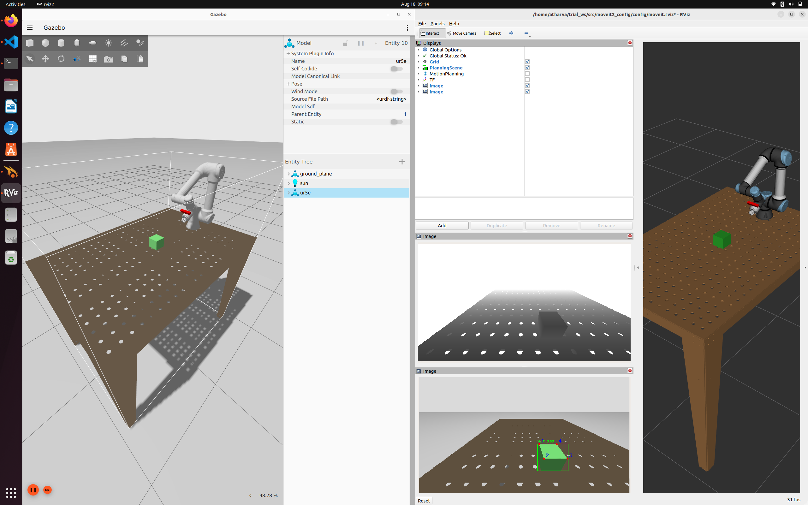
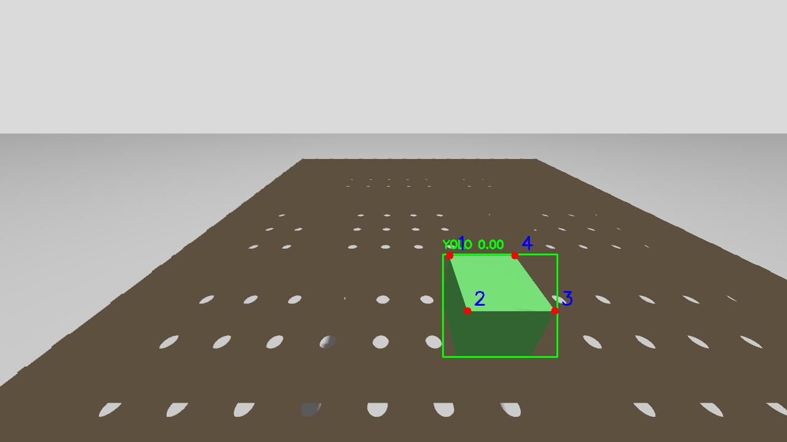
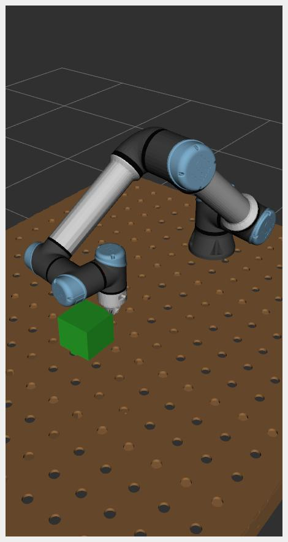

# CNC_UR5e
MSc Thesis for Precision CNC Machining using UR5e
## Images

### ROS2 Simulation Setup

### YOLO Model for Block Detection  

### Robot moving to corner position

### Video
<video width="600" controls>
  <source src="[CNC UR5e Sim Demo.webm](https://github.com/Ath0601/CNC_UR5e/raw/refs/heads/main/CNC%20UR5e%20Sim%20Demo.webm)" type="video/webm">
  Your browser does not support the video tag.
</video>
